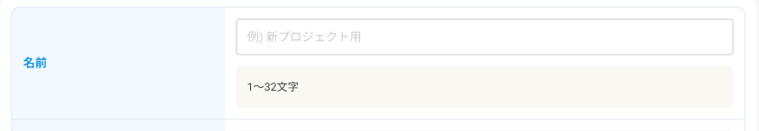

import Header from '../../../components/Header.astro'

<Header {...frontmatter} />

フロントエンドエンジニアが、デザイナーのつくったUIデザインを見たときの頭の中を整理してみる。

たとえば以下のようなUIデザインをあったとする。



私は、このUIデザインを見たときに「見た目」ではなく「構造」に着目して、どのような要素が含まれているか考える。

```jsx
<Field>
  <FieldLabel>
    <Label for="name">名前</Label>
    <Required />
  </FieldLabel>
  <FieldInput>
    <TextInput id="name" placeholder="新プロジェクト用"/>
    <Message>1〜32文字</Message>
  </FieldInput>
</Field>
```

その後、脳内コンパイラを実行させて、HTMLとCSSに変換する。
```html
<div class="field">
  <div class="field-label">
    <label class="label" for="name">名前</label>
    <span class="icon -required"></span>
  </div>
  <div class="field-input">
    <input class="input" id="name" type="text" placeholder="新プロジェクト用"/>
    <p class="message">1〜32文字</p>
  </div>
</div>
```

このように構造から考えることで、「なぜこのようなUIになったのか」という理由が見えてくる。できればこのレベルのことをデザイナーにもやってもらって、統一感のあるUIデザインをしてほしい。
