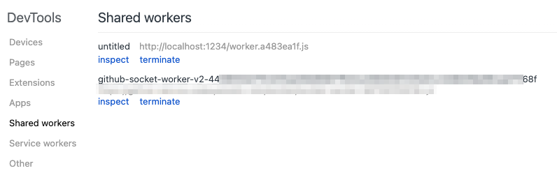

import Header from '../../../components/Header.astro'

<Header {...frontmatter} />

[SharedWorker](https://developer.mozilla.org/ja/docs/Web/API/SharedWorker)はそのままだとWorker内で発生したエラーや`console.log()`が見れない。

`chrome://inspect/#workers`から対象のSharedWorkerを見つけ、`inspect`を押すことでWorkerのDevToolsを開くことができる。

