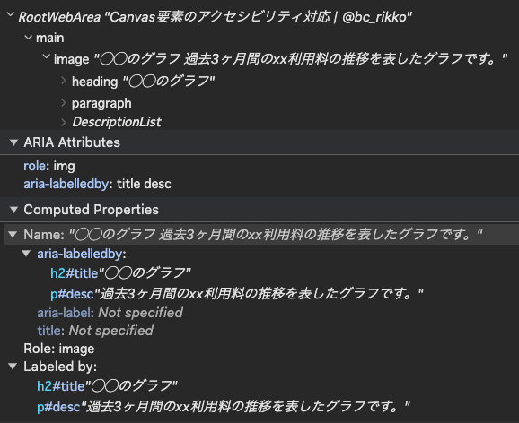

import Header from '../../../components/Header.astro'

<Header {...frontmatter} />

Canvas要素の内容はスクリーンリーダーに読み上げられないため、なんらかの対策が必要。

## Canvas要素のアクセシビリティ対応

1. Canvas要素には代替テキストをつける
  - ただし、Canvas要素にはalt属性が使えない
  - `aria-label` + `role="img"`で画像として提供する
2. フォールバックコンテンツを含める
3. 背景を塗りつぶし、ハイコントラストモードに対応する

```html
<canvas role="img" aria-labelledby="title desc">
  <!-- canvas要素内にフォールバックコンテンツを含める -->
  <h2 id="title">◯◯のグラフ</h2>
  <p id="desc">過去3ヶ月間のxx利用料の推移を表したグラフです。</p>
  <dl>
    <dt>7月のxx利用料</dt>
    <dd>12,345円</dd>
    <dt>6月のxx利用料</dt>
    <dd>12,345円</dd>
    <dt>5月のxx利用料</dt>
    <dd>12,345円</dd>
  </dl>
</canvas>
```

### デモ

※canvasのコンテンツは表示されないが、フォールバックコンテンツを含めているのでアクセシビリティツリーに登録される
<canvas role="img" aria-labelledby="title desc" style="border: 4px solid;">
  <h2 id="title">◯◯のグラフ</h2>
  <p id="desc">過去3ヶ月間のxx利用料の推移を表したグラフです。</p>
  <dl>
    <dt>7月のxx利用料</dt>
    <dd>12,345円</dd>
    <dt>6月のxx利用料</dt>
    <dd>12,345円</dd>
    <dt>5月のxx利用料</dt>
    <dd>12,345円</dd>
  </dl>
</canvas>




## Canvasの代わりにSVGを使う

SVG自体がマシンリーダブルなので、特に手を加えなくてもaria属性を使うことでアクセシブルになる。

```html
<svg class="chart" width="420" height="150" aria-labelledby="title desc" role="img">
  <title id="title">A bar chart showing information</title>
  <desc id="desc">4 apples; 8 bananas; 15 kiwis; 16 oranges; 23 lemons</desc>
  <g class="bar">
    <rect width="40" height="19"></rect>
    <text x="45" y="9.5" dy=".35em">4 apples</text>
  </g>
  ...
</svg>
```

<svg class="chart" width="420" height="150" aria-labelledby="title desc" role="img">
  <title id="title">A bar chart showing information</title>
  <desc id="desc">4 apples; 8 bananas; 15 kiwis; 16 oranges; 23 lemons</desc>
  <g class="bar">
    <rect width="40" height="19"></rect>
    <text x="45" y="9.5" dy=".35em">4 apples</text>
  </g>
  <g class="bar">
    <rect width="80" height="19" y="20"></rect>
    <text x="85" y="28" dy=".35em">8 bananas</text>
  </g>
  <g class="bar">
    <rect width="150" height="19" y="40"></rect>
    <text x="150" y="48" dy=".35em">15 kiwis</text>
  </g>
  <g class="bar">
    <rect width="160" height="19" y="60"></rect>
    <text x="161" y="68" dy=".35em">16 oranges</text>
  </g>
  <g class="bar">
    <rect width="230" height="19" y="80"></rect>
    <text x="235" y="88" dy=".35em">23 lemons</text>
  </g>
</svg>
