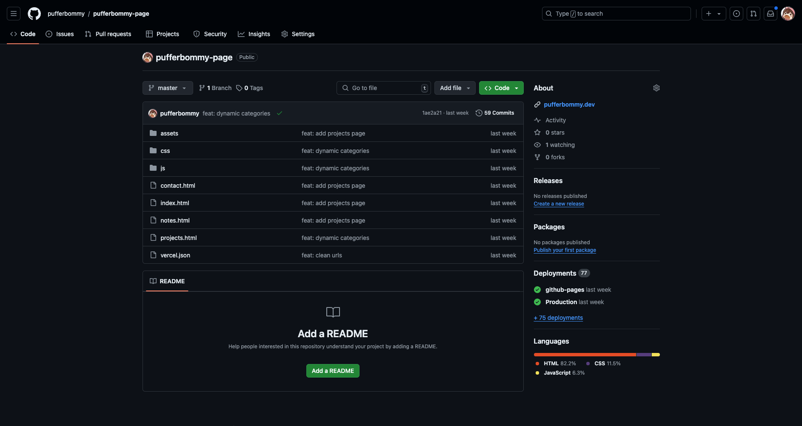
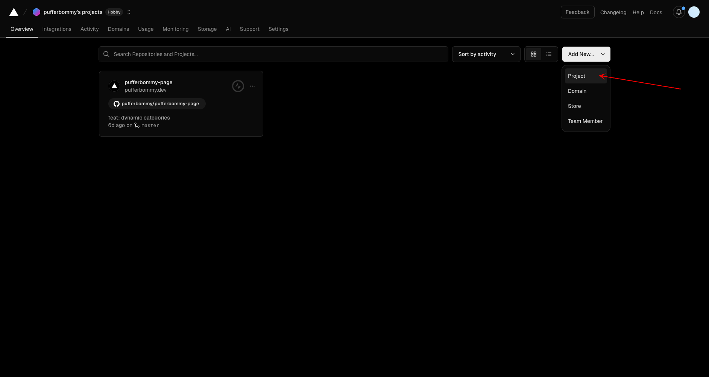
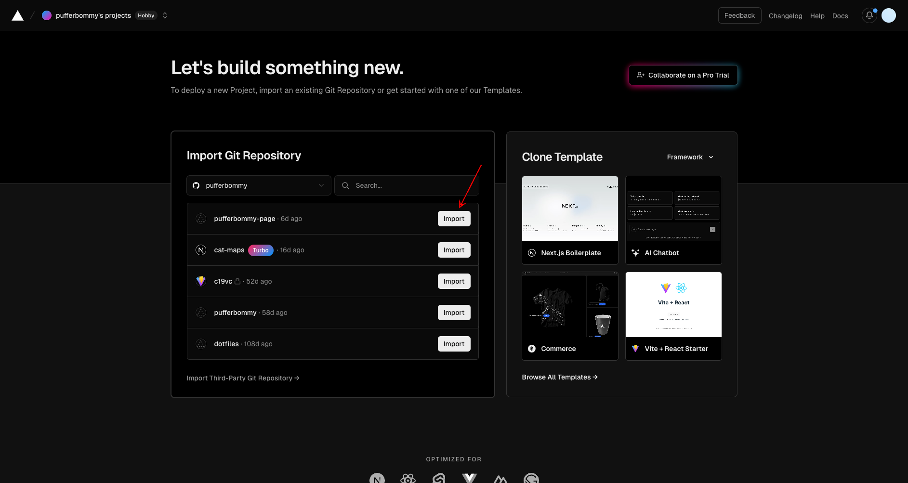
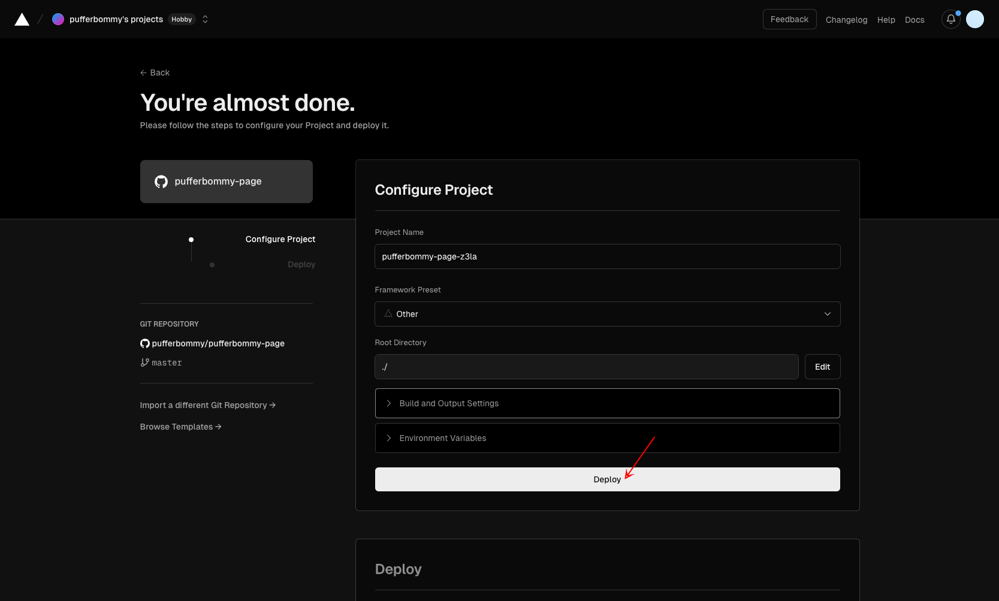
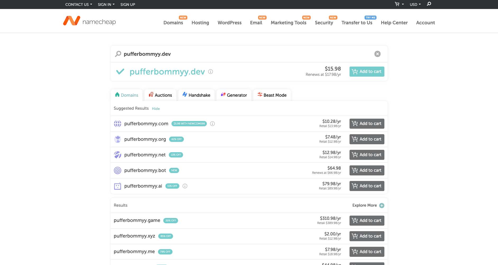
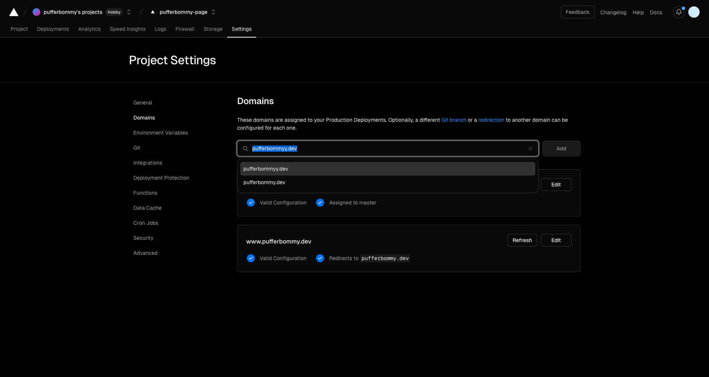
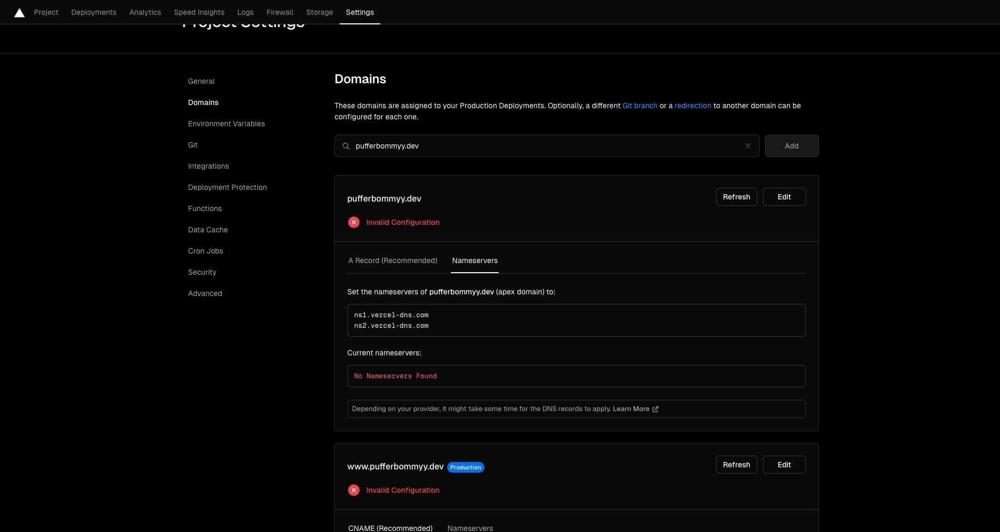
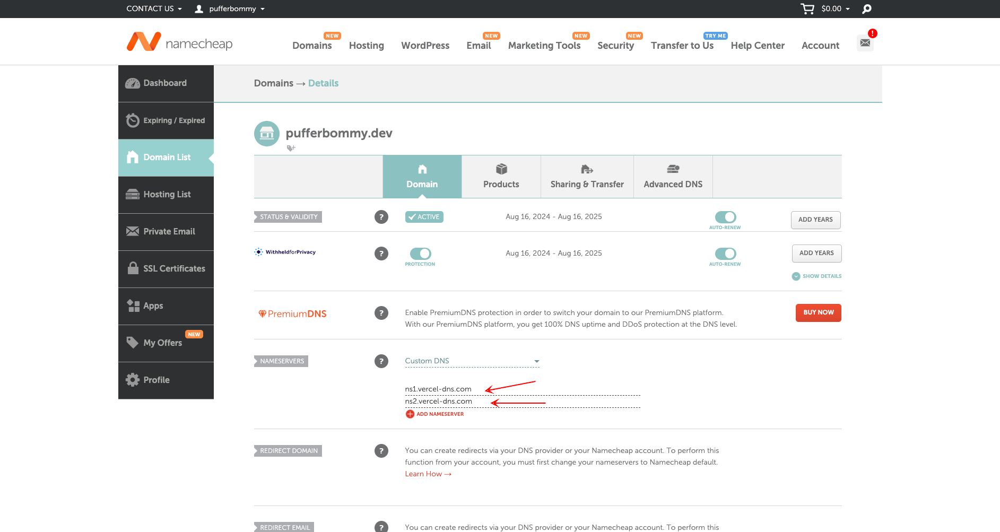

import Header from '../../../components/Header.astro'

<Header {...frontmatter} />

Deploying a website with a custom domain can seem intimidating at first, but it’s actually straightforward. Here’s how I did it:

### Step 1: Create a GitHub Repository
First, I created a GitHub repository and pushed my website's code to the repository.

---

### Step 2: Add a New Project to Vercel
Next, I added a new project to Vercel by importing the repository directly from GitHub. 

---

### Step 3: Deploy the Website
Once the project was set up, I deployed the website on Vercel. 

At this point, the website was live, but it was using Vercel's default domain instead of my custom domain.

---

### Step 4: Purchase a Custom Domain
I purchased a custom domain from Namecheap. 

---

### Step 5: Add the Domain to Vercel
After purchasing the domain, I added it to Vercel.

---

### Step 6: Configure Nameservers
To make the custom domain work, I configured the nameservers on Namecheap. After setting up the nameservers, I waited a few minutes for the changes to propagate.

---

### And It’s Live!
Now, my website is live with a custom domain. The entire process was seamless, and I’m excited to see it all come together!
