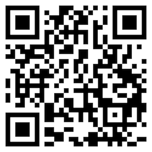

import Header from '../../../components/Header.astro'

<Header {...frontmatter} />

ピクセルアート（ドット絵）やQRコードのような小さな画像を拡大表示するとアンチエイリアスによって輪郭がぼやけてしまう。

[image-rendering](https://developer.mozilla.org/ja/docs/Web/CSS/image-rendering)で画像の拡大縮小時のアルゴリズムを指定することでアンチエイリアスを無効化できる。

```css
.pixel-art {
  image-rendering: pixelated;
}
```

## デモ

<section id="demo">
  <h2>デフォルト</h2>
  <span class="default"></span>
  <h2>image-rendering: pixelated;</h2>
  <span class="pixelated"></span>
</section>

<style>{`
#demo {
  img {
    width: 40vw;
    height: 40vw;

  }
  .pixelated > img {
    image-rendering: pixelated;
  }
}
`}</style>
