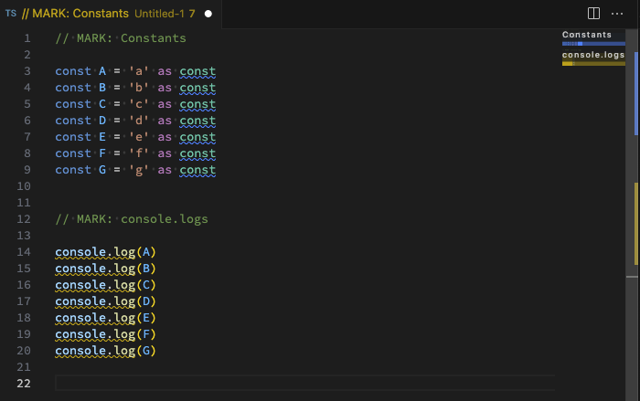

import Header from '../../../components/Header.astro'

<Header {...frontmatter} />

VSCode には Minimap というファイル全体をプレビューする機能がある。`// MARK:` や `// #region` などを使うことでミニマップにラベル（目印）を表示できる。


```ts
// MARK: Constants
const A = 'a' as const
...

// #region Console.logs
console.log(A)
```


