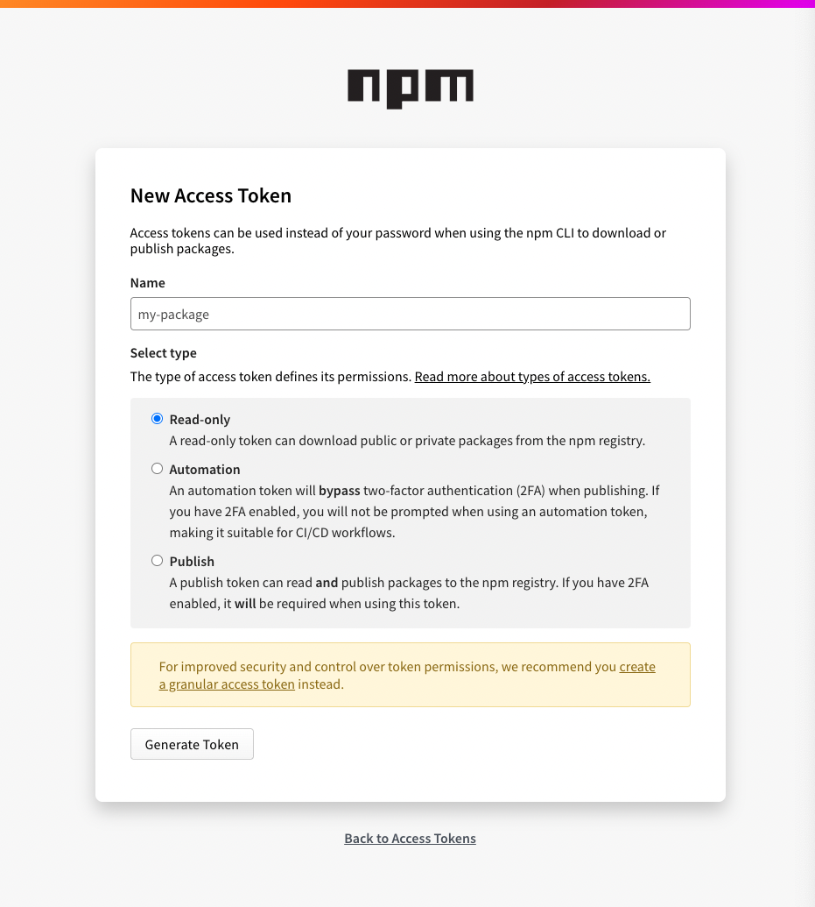
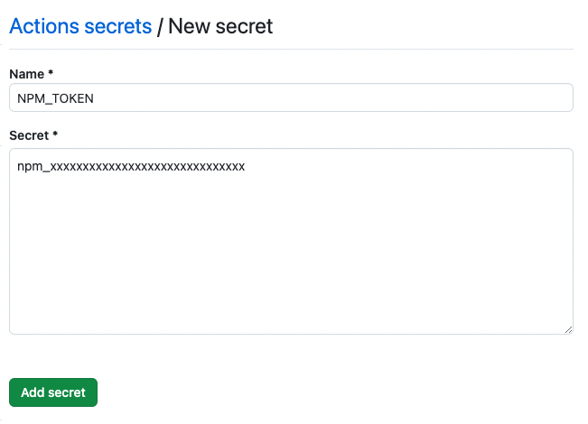

import Header from '../../../components/Header.astro'

<Header {...frontmatter} />

`npm publish`を手作業でやるのは大変なので、GitHub Actionsを使ってやってみる。

## npmjsでアクセストークンを発行する

1. アカウントメニュー > Access Tokens
2. Generate New Token > Classic Tokenをクリック
3. Nameにわかりやすい名前（たとえばパッケージ名など）を設定
4. Select typeでは~~`Publish`~~`Automatic`を選択
5. 「Generate Token」をクリック
6. 「Token successfully generated」と表示されるので`npm_xxxxx`というトークンをコピーする



## 追記: 2024-12-20

Select typeで`Publish`を指定していたところ、以下のような one-time password のエラーが出てしまった。Select typeを`Automatic`にして再度トークンを作成したことで対処できた。

```
npm error This operation requires a one-time password from your authenticator.
npm error You can provide a one-time password by passing --otp=<code> to the command you ran.
npm error If you already provided a one-time password then it is likely that you either typoed
npm error it, or it timed out. Please try again.
npm error A complete log of this run can be found in: /home/runner/.npm/_logs/2024-12-20T04_29_31_894Z-debug-0.log
```

## npmjsのアクセストークンをリポジトリのSecretsに登録する

1. Settings > Security: Secrets and variables > Actions をクリック
2. 「New repository secret」をクリック
3. Nameに`NPM_TOKEN`、Secretにnpmjs.org



## GitHub Actionsのワークフローを設定する

```yaml
name: Publish Package to npmjs
# npm publishするタイミング
on:
  release:
    types: [published] # Releaseノートが更新されたとき
jobs:
  publish:
    runs-on: ubuntu-latest
    permissions:
      contents: read
      id-token: write
    steps:
      - uses: actions/checkout@v4
      - uses: actions/setup-node@v4
        with:
          node-version: '22.x'
          registry-url: 'https://registry.npmjs.org'
      - run: npm ci
      - run: npm publish --provenance --access public
        env:
          NODE_AUTH_TOKEN: ${{ secrets.NPM_TOKEN }}
```

これで、Releaseが作成されたタイミングで`npm publish`が実行されて、パッケージが公開される。

TypeScriptなどビルドが必要な言語を使っている場合は、`npm ci`と`npm publish`の間に`npm run build`のようなコマンドを実行する。

## 注意

`package.json`のバージョンは手動で更新するか、なんらかのスクリプトを使ってインクリメントしないと、同じバージョンが登録されているというエラーが出てpublishできない。


## 参考

- [Node\.jsパッケージの公開 \- GitHub Docs](https://docs.github.com/ja/actions/use-cases-and-examples/publishing-packages/publishing-nodejs-packages)
- [GitHub Actions でのシークレットの使用 \- GitHub Docs](https://docs.github.com/ja/actions/security-for-github-actions/security-guides/using-secrets-in-github-actions)
- [npmレジストリの利用 \- GitHub Docs](https://docs.github.com/ja/packages/working-with-a-github-packages-registry/working-with-the-npm-registry)
- [リポジトリのリリースを管理する \- GitHub Docs](https://docs.github.com/ja/repositories/releasing-projects-on-github/managing-releases-in-a-repository)
