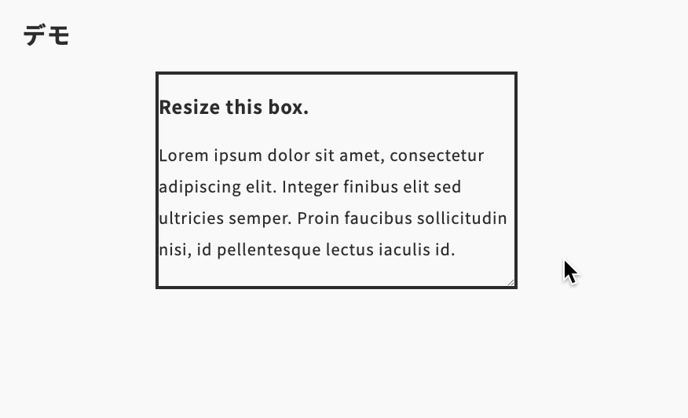

import Header from '../../../components/Header.astro'
import Baseline from '../../../components/Baseline.astro'

<Header {...frontmatter} />

[Scroll-Driven Animation](https://developer.mozilla.org/ja/docs/Web/CSS/CSS_scroll-driven_animations)の機能を使うことで、CSSだけでOverflowやスクロールバーの表示を検出できる。

Scroll-Driven Animation（スクロール駆動アニメーション）のサポート状況は、以下の通り。

<Baseline featureId={"scroll-driven-animations"} />

```html
<section class="box">
  <h1>Resize this box.</h1>
  <p>Lorem ipsum dolor sit amet, consectetur adipiscing elit. Integer finibus elit sed ultricies semper. Proin faucibus sollicitudin nisi, id pellentesque lectus iaculis id.</p>
</section>
```

```css
.box {
  overflow: auto;
  animation: scrolling forwards;
  animation-timeline: scroll(self);
}

@keyframes scrolling {
  /* スクロールが発生したときに、このスタイルが適用される */
  from,to {
    background-color: red;
  }
}
```

## デモ

<section id="demo">
<section class="box">
  <h1>Resize this box.</h1>
  <p>Lorem ipsum dolor sit amet, consectetur adipiscing elit. Integer finibus elit sed ultricies semper. Proin faucibus sollicitudin nisi, id pellentesque lectus iaculis id.</p>
</section>
</section>

<style>{`
#demo {
  height: 300px;
  .box {
    justify-self: center;
    width: 40ch;
    resize: both;
    border: solid 4px;
    overflow: auto;
    animation: scrolling forwards;
    animation-timeline: scroll(self);
  }
}

@keyframes scrolling {
  from,to {
    background-color: red;
  }
}
`}</style>




## 参考サイト

- [Overflow/scrollbar detection using modern CSS](https://css-tip.com/overflow-detection/)
