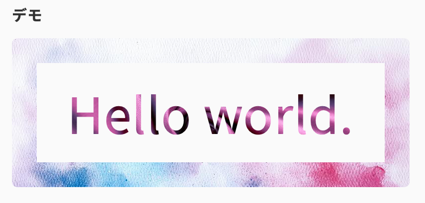

import Header from '../../../components/Header.astro'
import Baseline from '../../../components/Baseline.astro'

<Header {...frontmatter} />

[Safari 18.2](https://webkit.org/blog/16301/webkit-features-in-safari-18-2/)で[background-clip: border-area](https://developer.mozilla.org/ja/docs/Web/CSS/background-clip)がサポートされた。

サポート状況は以下のとおり。

<Baseline featureId={"background-clip-text"} />
<Baseline featureId={"background-clip-border-area"} />

`background-clip`を使うことで、`background-image`などで指定した背景を切り抜き、表示することができる。

```html
<section class="clip">
  Hello world.
<section>
```

```css
.clip {
  /* 色が残っていると背景画像が見えないため */
  color: transparent;
  border-color: transparent;

  background-image:
    url(/* ボーダーのテクスチャ */),
    url(/* テキストのテクスチャ */);
  background-clip:
    border-area,
    text;
}
```

## デモ

※一部ブラウザでは正常に表示できません

<section id="demo">
  <div class="clip">
    Hello world.
  </div>
</section>

<style>{`
#demo {
  .clip {
    text-align: center;
    font-size: 5rem;
    color: transparent;
    border: 50px solid transparent;
    background-image:
      url(https://github.com/user-attachments/assets/46644010-2592-4bc9-ab6f-576d42c669f1),
      url(https://github.com/user-attachments/assets/b1a5f111-6814-42eb-ad5e-2687e4c3f0e0);
    background-clip: border-area, text;
    background-size: cover;
    background-origin: border-box;
    border-radius: 10px; 
  }
}
`}</style>

## デモ画像


