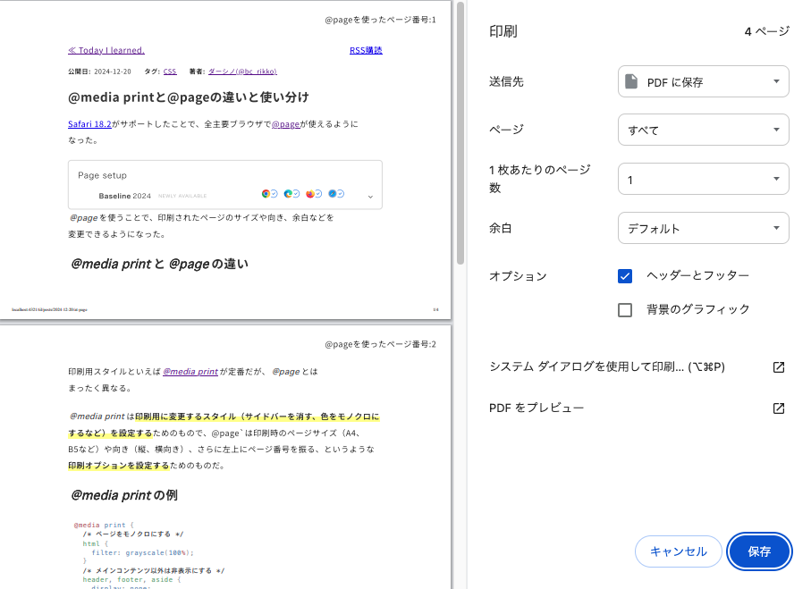

import Header from '../../../components/Header.astro'
import Baseline from '../../../components/Baseline.astro'

<Header {...frontmatter} />

[Safari 18.2](https://developer.apple.com/documentation/safari-release-notes/safari-18_2-release-notes)がサポートしたことで、全主要ブラウザで[@page](https://developer.mozilla.org/en-US/docs/Web/CSS/@page)が使えるようになった。

<Baseline featureId={"page-setup"} />

`@page`を使うことで、印刷されたページのサイズや向き、余白などを変更できるようになった。

## `@media print`と`@page`の違い

印刷用スタイルといえば[`@media print`](https://developer.mozilla.org/en-US/docs/Web/CSS/CSS_media_queries/Printing)が定番だが、`@page`とはまったく異なる。

`@media print`は**印刷用に変更するスタイル（サイドバーを消す、色をモノクロにするなど）を設定する**ためのもので、@page`は印刷時のページサイズ（A4、B5など）や向き（縦、横向き）、さらに左上にページ番号を振る、というような**印刷オプションを設定する**ためのものだ。

## `@media print`の例
```css
@media print {
  /* ページをモノクロにする */
  html {
    filter: grayscale(100%);
  }
  /* メインコンテンツ以外は非表示にする */
  header, footer, aside {
    display: none;
  }
}
```

## `@page`の例
```css
@page {
  size: a4 landscape;
  margin: 1in;
}

@page :left {
  margin-top: 1in;
}

@page :right {
  margin-top: 1in;
}

body {
  counter-reset: pageNumber;
}
@page {
  counter-increment: pageNumber;
  @top-right {
    content: "Page " counter(pageNumber);
  }
}
```

## デモ

<section id="demo">
  <button type="button" onclick="window.print()">印刷する</button>
</section>

<style>{`
body {
  counter-reset: pageNumber;
}
@page {
  size: a4 landscape;
}

@page :left {
  margin-top: 1in;
}

@page :right {
  margin-top: 1in;
}

@page {
  counter-increment: pageNumber;
  @top-right {
    content: "@pageを使ったページ番号:" counter(pageNumber);
  }
}
`}</style>

<figure>



<figcaption>A4サイズ、横向き、右上にページ番号をふった場合の印刷プレビュー</figcaption>

</figure>
