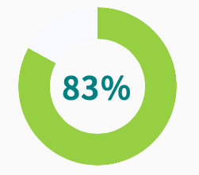

import Header from '../../../components/Header.astro'
import Baseline from '../../../components/Baseline.astro'

<Header {...frontmatter} />

グラデーション関連のCSS関数に、[conic-gradient()](https://developer.mozilla.org/ja/docs/Web/CSS/gradient/conic-gradient)がある。この関数は、中心点の周りをまわりながら色が変化する画像を生成する。

このCSS関数を使うことで、円グラフがCSSだけで簡単に作れる。

<Baseline featureId={"conic-gradients"} />

## conic-gradient()の基礎

```css
/* 自動的にグラデーションする */
.rainbow {
  background: conic-gradient(
    red, orange, yellow, green, blue, indigo, violet
  );
}

/* 色の範囲を角度で指定する */
.deg {
  background: conic-gradient(
    red 45deg,
    orange 45deg 90deg,
    yellow 90deg 135deg,
    green 135deg 180deg,
    blue 180deg 225deg,
    indigo 225deg 270deg,
    violet 270deg 315deg,
    purple 315deg 360deg
  );
}
```

<section id="demo">
  <figure>
    <div class="conic rainbow"></div>
    <figcaption>.gradient</figcaption>
  </figure>

  <figure>
    <div class="conic deg"></div>
    <figcaption>.deg</figcaption>
  </figure>
</section>

<style>{`
#demo {
  display: flex;

  .conic {
    aspect-ratio: 1;
    width: 200px;
  }

  .rainbow {
    background: conic-gradient(
      red, orange, yellow, green, blue, indigo, violet
    );
  }
  .deg {
    background: conic-gradient(
      red 45deg,
      orange 45deg 90deg,
      yellow 90deg 135deg,
      green 135deg 180deg,
      blue 180deg 225deg,
      indigo 225deg 270deg,
      violet 270deg 315deg,
      purple 315deg 360deg
    );
  }
}
`}</style>


## conic-gradient()を使った円グラフ

```css
.pie {
  --percent: 83%;
  border-radius: 50%;
  background: conic-gradient(
    from 0deg,
    yellowgreen 0 var(--percent),
    ghostwhite var(--percent) 100%
  );
}
```

<section id="demo2">
  <div class="pie">
    <span>83%</span>
  </div>
</section>

<style>{`
#demo2 {
  .pie {
    aspect-ratio: 1;
    width: 200px;
    --percent: 83%;
    border-radius: 50%;
    background: conic-gradient(
      from 0deg,
      yellowgreen 0 var(--percent),
      ghostwhite var(--percent) 100%
    );

    align-content: center;
    display: grid;
    place-content: center;
    span {
      font-weight: 600;
      font-size: 2rem;
      color: teal;
    }
  }
}
`}</style>

## `background-clip`を使ったドーナツグラフ

`background-clip: border-area`を使うことで、ドーナツグラフ（中抜き円グラフ）を作れる。

<Baseline featureId={"background-clip-border-area"} />

```css
.donut {
  --percent: 83%;
  border-radius: 50%;
  background: conic-gradient(
    from 0deg,
    yellowgreen 0 var(--percent),
    ghostwhite var(--percent) 100%
  );

  /* border-areaで切り抜く */
  background-clip: border-area;
  background-origin: border-box;
  border: 10px solid transparent;
}
```

<section id="demo3">
  <div class="donut">
    <span>83%</span>
  </div>
</section>

<style>{`
#demo3 {
  .donut {
    aspect-ratio: 1;
    width: 200px;
    --percent: 83%;
    border-radius: 50%;
    background: conic-gradient(
      from 0deg,
      yellowgreen 0 var(--percent),
      ghostwhite var(--percent) 100%
    );
    background-clip: border-area;
    background-origin: border-box;
    border: 2rem solid transparent;

    align-content: center;
    display: grid;
    place-content: center;
    span {
      font-weight: 600;
      font-size: 2rem;
      color: teal;
    }
  }
}
`}</style>


<figure style="max-width: 40ch;">


<figcaption>ドーナツグラフ（ブラウザ:Safari TP）</figcaption>
</figure>
