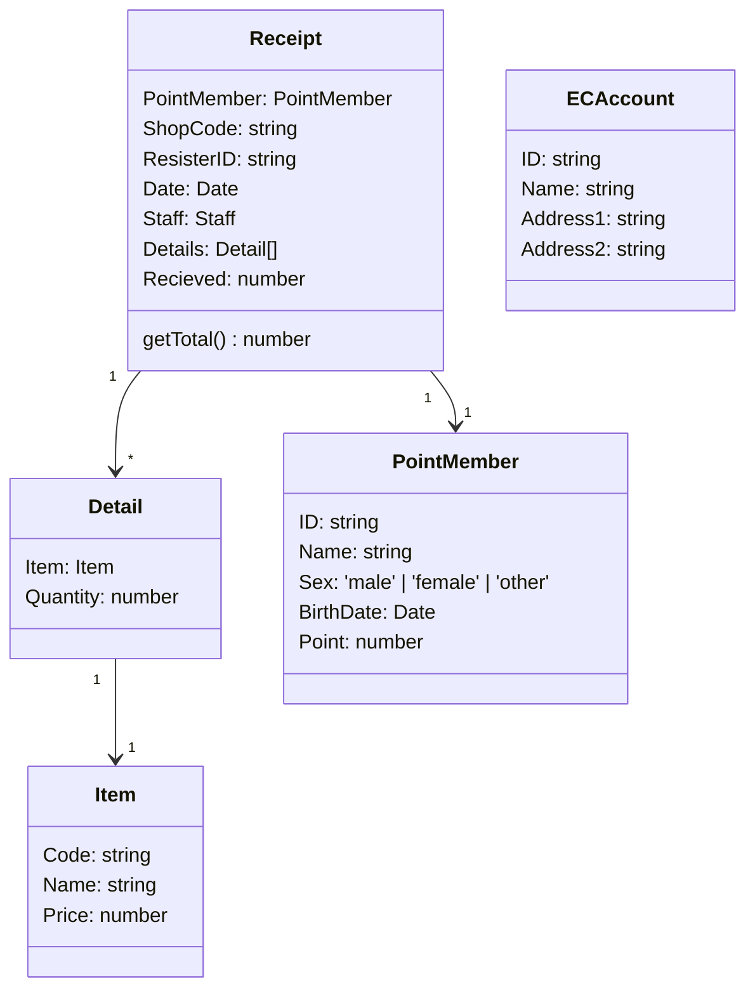
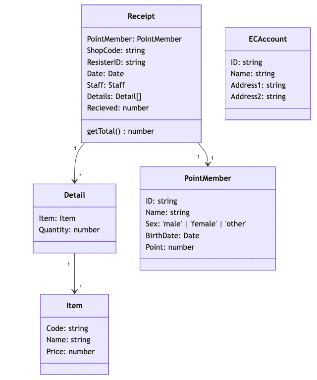

import Header from '../../../components/Header.astro'

<Header {...frontmatter} />

2025年1月18日（土）、19日（日）の2日間にわたり、令和7年度の大学入学共通テストが行われた。

著者は、ソフトウェアエンジニアとしてキャリアを積んでいるので「情報I」程度の問題は全問正解できないといけないので、実際に解いてみた。ついでに自分自身の振り返りも兼ねて解説してみた。

問題集は[東進ハイスクールが公開しているPDF](https://www.toshin.com/kyotsutest/data/3092/jouhou1.pdf)を利用した。

解答は[大学入試センターが公開しているPDF](https://www.dnc.ac.jp/albums/abm.php?d=699&f=abm00005172.pdf&n=R7_%E3%80%90%E6%83%85%E5%A0%B1%E2%85%A0%E3%80%91%E6%9C%AC%E8%A9%A6%E9%A8%93%E3%81%AE%E6%AD%A3%E8%A7%A3.pdf)を利用した。

## 第1問

### 問1

デジタル署名に関する問題。

デジタル署名とは公開鍵暗号を応用した技術で、送信者が本人であることを証明することができる。

1. 送信者がキーペア（秘密鍵と公開鍵）を生成する
2. 送信者が事前に受信者に対し公開鍵を送付する
3. 送信者がデータのハッシュ値を算出し、秘密鍵を用いて暗号化する
4. 元データに暗号化したハッシュ値を署名として付与して送信する
5. 受信者は公開鍵を用いてハッシュ値を復号する
6. 受信者自身でもハッシュ値を算出する
7. 5と6で算出したハッシュ値を比較して一致していれば送信者本人から送られたデータだと確認できる

ゆえに、デジタル署名を用いることで **「ア:2.改ざんされていないか」** を検知することができる。

---

現在IPアドレスはIPv4という32bit（0.0.0.0〜255.255.255.255）のアドレスを使うのが主流となっている。

32bitで表現できるアドレスの数は、2の32乗（約43億）個であるが、一部のアドレスはプライベート用のアドレスとして使われたり、特別な用途として扱うため、実際にグローバルアドレスとして使えるIPアドレスは約37億個になる。昨今はインターネット技術の普及により、インターネットにつながるデバイス（パソコン、サーバー、IoT機器など）が増えてきて、付与できるIPアドレスが不足している。

そのため、より多くのIPアドレスを表現するために、128bitで構成されるIPv6が利用されるようになった。

ゆえに、IPv6が使われるようになった理由は **「イ:2.インターネットに直接接続する機器の増加に対応するため」** である。


### 問2

7セグメントディスプレイに関する問題。

7セグメントディスプレイは、7つのライトのON/OFFで数字やアルファベットなどを表現することができる。

ゆえに、7セグメントディスプレイの組み合わせは全部で **「ウエオ:128通り」** である。

---

```
// 利用する英数字
AbcdEFHJLnPUy
0123456789
```

1桁目は大文字アルファベット（8種）、2桁目は小文字アルファベット（5種）、3桁目以降は数字（10種）のみでエラーコードを表現する。

```
8 * 5 * 10^n >= 5000
40 * 10^n >= 5000
n=1 … 400 ×
n=2 … 4000 ×
n=3 … 40000 〇
```

5000種類のエラーコードを表現するためには、数字部分に3桁必要となる。

ゆえに、7セグメントLED部品は大文字部、小文字部、数字部をあわせて **「カ:5個」** 必要となる。


### 問3

チェックディジットの計算方法に関する問題。

チェックディジットとは、主にデータの入力時や伝送時に発生するエラーを検知するために用いられる数字で、特定のアルゴリズムに基づいて元のデータから計算され、末尾などに付与される。身近なものでは商品についているバーコード（JANコード）などで使われている。

この問題では5桁の利用者ID（N5,N4,N3,N2,N1）に対して、チェックディジット（C）を生成する方法が提示されている。


```
## チェックディジットの生成方法A
利用者IDの各桁の合計し、10で割った余りRを求め、10からRを引いた値

## チェックディジットの生成方法B
利用者IDの各奇数桁（N5, N3, N1）の値をそれぞれ3倍
各偶数桁（N4, N2）の値を足し合わせ
それを10で割った余りRを求め、10からRを引いた値
```

利用者ID:22609の場合のチェックディジットを計算してみる。

```
利用者ID: 22609

## 生成方法A
2 + 2 + 6 + 0 + 9 = 19
19 % 10 = 9
10 - 9 = 1
Ans. 1

## 生成方法B
(2 * 3) + 2 + (6 * 3) + 0 + (9 * 3) = 53
53 % 10 = 3
10 - 3 = 7
Ans. 7
```

ゆえに、生成方法Bで利用者ID22609のチェックディジットを計算すると **「キ:7」** となる。

また、生成方法Bでは **「ク:3.連続する二つの桁の数字の順序を逆にする」** 入力ミスを検出できる。

他の選択肢は実際にやってみると入力ミスを検出できないことがわかる。


### 問4

フィッツの法則に関する問題。

> 対象物が大きいほど、対象物に移動するときの時間が短くなる  
> 対象物への距離が短いほど、対象物に移動するときの時間が短くなる

「フィッツの法則（Fitts' Law）」と呼ばれる法則のことを指している。

ゆえに、画面端にあるオブジェクトはサイズが無限大と考えるため、画面端にありマウスカーソルに近い **「ケ:2」** のオブジェクトが最も短い時間で指し示すことができる。

---

右クリックでコンテキストメニューを表示する場合、距離が一番遠くにある「項目5」は指し示すのに一番時間がかかるため、利用頻度が **「コ:0.低い」** 項目なので、意図的に **「サ:1.マウスカーソルの位置から遠い場所」** に配置されていることが考えられる。


## 第2問

### A. 総合スーパーマーケットのレジ・ECサイト・配送などを含めた総合システムの問題





#### 問1

レジシステムのデータ分析に関する問題。

「時間帯ごとの総売上額（税込）」の比較は「購入時刻」と **「ア:5.購入した商品の合計金額」** を用いて分析する。

「曜日別の各商品の購買の状況」を把握するためには「購入日、曜日」と **「イ:3.商品コード,購入商品名」** と **「ウ:4.購入した商品の個数」** を用いて分析する。


#### 問2

ポイント会員情報とレシート情報だけでは **「エ:0.顧客が商品を購入した理由」** は得られない。

なお、PointMemberとReceiptが紐づいているため、顧客が繰り返し購入する商品、購入する年齢層、年齢・性別による来店時間帯などは調べることができる。

#### 問3

```

+---------+            +------+            +----------+
| DCenter | -(item)--> | Shop | -(item)--> | Customer |
+---------+            +------+ <--(Info)- +----------+
  ^          ＼           |
  |            ＼(Info)  (Info)
(item)           ＼       |
  |                ＼     v
+-------+            +----+
| Maker | <--(Info)- | HQ |
+-------+            +----+
```

- I 店コード **「オ:3.あ、い」**
  - 各店舗から本部へ情報を渡すときに自身の店コードがないと、どの店の売上情報かわからないため必要
  - 配送センターから各店舗へ商品を配送するとき、どの店に配送するか知る必要があるため必要
- II ポイント会員ID **「カ:5.い、う」**
  - 顧客がポイントカードを提示しているため
  - 本部がどんな客層がどんな商品を購入しているか把握するために必要


#### 問4

ネットショッピングのアカウントと、実店舗用のポイント会員を連携するメリットを問うている。

- I 顧客がネットショッピングサイトにログインしたときに、現在のポイントカードのポイント数と自宅に近い実店舗の広告チラシが自動的に表示される。
  - 実現するためには以下の2つの情報が必要
    - ポイント数を持っているポイント会員情報
    - 住所を登録しているECアカウント情報
  - ゆえに、 **「キ:0.あ」**
- II 顧客がネットショッピングで商品を購入しようとするとき、その顧客がポイントカードをよく利用する実店舗のうちで、その商品の在庫がある実店舗の情報が表示される
  - 実現するためには以下の情報が必要
    - ネットショッピングを使うためのECアカウント情報
    - ポイントカードをよく使う店舗を知るためのポイント会員情報
    - 商品の在庫情報
    - ECサイトで扱われている商品と実店舗で用いられる商品コード
  - ゆえに、 **「ク:6.あ、い、う」**
- III 顧客がネットショッピングサイトにログインしたときに、商品の購入傾向が実店舗も含めて類似している他の顧客の購入履歴をもとに、おすすめ商品を画面に表示する。
  - 実現するためには以下の情報が必要
    - ECサイトと実店舗での購入傾向を知るためにECアカウント情報とポイント会員情報
    - 購入傾向を知るため実店舗で用いられている商品コード
  - ゆえに、 **「ケ:3.あ、い」**

---

### B. おつり計算シミュレーションに関する問題

#### シミュレーション条件

- グループのメンバーは、来た順番に一人ずつMさんにお金を支払う
- メンバーは、必ず千円札6枚、または一万円札のいずれかで支払う
- メンバーが一万円札で支払った場合、おつりは千円札4枚で渡す
- メンバーが千円札6枚で支払う確率を30%、一万円札で支払う確率を70%とする

- r...1〜10の整数が同確率ででる乱数
  - 3以下: 千円札6枚で支払う
  - 4以上: 一万円札で支払う

#### 問１

||乱数r|手元の一万円の枚数|手元の千円札の枚数|
|---|---|---|---|
|初期値|-|0|0|
|1人目|8|1|-4|
|2人目|1|1|2|
|3人目|6|2|-2|
|4人目|10|3|-6|
|5人目|9|?（4）|?（-10）|
|6人目|4| **「コ:5」** |?（-14）|
|7人目|5|?（6）|?（-18）|
|8人目|3|?（6）| **-「サシ:12」**|
|9人目|7|?（7）|?（-16）|
|10人目|2|?（7）|?（-10）|

一度も千円札が不足することなく集金するためには、最小枚数になるときを対処すればよいので **「スセ:18」** 枚必要。


#### 問2

シミュレーションを10,000回行うためのコード。

```ts
const MEMBER = 10 as const

function simulate(): [number, number] {
  let countOf1_000 = 0
  let countOf10_000 = 0

  for (let i = 0; i < MEMBER; i++) {
    // 1〜10の乱数を生成
    const r = Math.ceil(Math.random() * 10))
    if (r <= 3) {
      countOf1_000 += 6
    } else {
      countOf10_000 += 1
      countOf1_000 -= 4
    }
  }

  return [countOf1_000, countOf10_000]
} 

for (let i = 0; i < 10_000; i++) {
  const [countOf1_000, countOf10_000] = simulate()
  console.log(
    `千円札:${countOf1_000}枚`,
    `一万円札:${countOf10_000}枚`
  )
}
```

グラフを見ると千円札が不足しなかったのは800回で、全体の8%なので **「ソ:1.最後まで千円札が不足しなかったのは、全回数の1割以下である」**

#### 問3

事前に千円札を20枚用意した場合。

- 0.全員が一万円札で支払うと千円札は-40枚となるので不足する
- 1.全員が千円札で支払うケースがある
- 2.5人が千円札で支払うと手持ちも含め最大で50枚になる。残り5人が1万円札で支払うと30枚になる
- 3.8人が1万円札で支払うと途中で不足する


ゆえに、 **「タ:2.千円札で支払った人が5人いて、途中でおつりの千円札が不足するケース」** は起こり得ない。


## 第3問

生産管理に関する問題。

### 問1

問1に関しては、生産管理というより国語の問題。

|工芸品|1|2|3|4|5|6|7|8|9|
|---|---|---|---|---|---|---|---|---|---|
|製作日数|4|1|3|1|3|4|2|4|3|

部員 **「ア:2」** が **「イ:2」** 日目から1日間製作することがわかる。

部員 **「ウ:2」** が **「エ:3」** 日目から **「オ:5」** 日目まで製作する。

### 問2

要素`Akibi[3]`は部員3の空き日が入る。3日までに作業を終えるので空きになるのは **「カ:4」** となる。

```ts
/** 
 * 空き日
 * 各部員が空きになる日付を管理する
 * 添字が部員番号となる（※出題では1オリジン）
 * 
 * Akibi[0] = 部員1の作業が開く日 
 * Akibi[1] = 部員2の作業が開く日 
 * Akibi[2] = 部員3の作業が開く日 
 */
const Akibi = [5, 3, 4]
// const Akibi: number[] = [5, 6, 4, 4, 4]

/**
 * 部員数
 */
const buinsu = 3
// const buinsu = 5

/**
 * 次の工芸品担当の部員番号を示す
 * [改変]配列は0オリジンなので0からはじめる
 */
let tantou = 0

// buinを2からbuinsuまで1ずつ増やしながら繰り返す
// [改変]配列は0オリジンなので1からはじめる
for (let buin = 1; buin < buinsu; buin++) {
  // ここでは、となりあう部員番号の人の空き日を比較して、空き日が最小となる部員をtantouに代入する
  // もし **「キ:1.Akibi[buin] < Akibi[tantou]」** ならば
  if (Akibi[buin] < Akibi[tantou]) {
    tantou = buin
  }
}

console.log(`次の工芸品の担当は部員${tantou + 1}です。`)
```

`Akibi = [5, 6, 4, 4, 4]`と`buinsu = 5`の場合、tantouに代入される回数は **「ク:1」** となる。

### 問3

```ts
/**
 * 各工芸品製作にかかる日数
 * 添字は工芸品番号と一致する
 */
const Nissu = [4, 1, 3, 1, 3, 4, 2, 4, 3]

/**
 * 製作する工芸品の数（= Nissu.length）
 */
const kougeihinsu = 9

/** 
 * 空き日
 * 各部員が空きになる日付を管理する
 * 添字が部員番号となる（※出題では1オリジン）
 * 初日は全員手が空いているので1日目を基準に初期化する
 */
const Akibi = [1, 1, 1]

/**
 * 部員数
 */
const buinsu = 3

// **「ケ:1.kougeihin」** を **「コ:4.kougeihinsu」** まで1ずつ増やしながら繰り返す
// [改変]配列は0オリジンなので0からはじめる
for (let kougeihin = 0; kougeihin < kougeihinsu; kougeihin++) {
  /**
   * 次の工芸品担当の部員番号を示す
   * [改変]配列は0オリジンなので0からはじめる
   */
  let tantou = 0

  // buinを2からbuinsuまで1ずつ増やしながら繰り返す
  // [改変]配列は0オリジンなので1からはじめる
  for (let buin = 1; buin < buinsu; buin++) {
    // ここでは、となりあう部員番号の人の空き日を比較して、空き日が最小となる部員をtantouに代入する
    // もし **「キ:1.Akibi[buin] < Akibi[tantou]」** ならば
    if (Akibi[buin] < Akibi[tantou]) {
      tantou = buin
    }
  }

  // **「サ:2.Nissu[kougeihin] - 1」**
  console.log(`工芸品${kougeihin + 1}…部員${tantou + 1}:${Akibi[tantou]}日目〜${Akibi[tantou] + Nissu[kougeihin] - 1}日目`)

  // **「シ:0.Nissu[kougeihin]」**
  Akibi[tantou] = Akibi[tantou] + Nissu[kougeihin]
}
```

## 第4問

データ分析に関する問題。

下表は観光庁が公開している旅行・観光消費動向調査のデータに関するデータ。

|番号|地方|出張等|帰省等|観光等|合計|
|---|---|---|---|---|---|
|1|北海道|3652|5052|9768|18472|
|2|東北|6161|9410|12365|27936|
|3|関東|14401|19138|45943|79482|
|10|沖縄|662|1127|5446|7235|


### 問1

地方の尺度水準は、郵便番号などと同じで **「ア:3.名義尺度」** を使う。「地方名」というカテゴリーで分類するものなので「名義」になる。

番号と地方以外の項目は、旅行者数を示すので **「イ:0.比例尺度」** を使う。旅行者数をただ表示しているだけなので、順序尺度ではない。他の旅行者数と比べるための数値なので「比例尺度」になりそう。

（尺度水準って言葉、はじめて聞いた…。）

縦軸に旅行者数、横軸に地方名をとった棒グラフは、カテゴリーごとの「具体的な数値」を比較するためなどにに用いられる。そのため選択肢は0 or 1となる。

縦軸に地方名、横軸に割合をとった帯グラフは、各データを「割合」で比較するために用いられる。そのため選択肢は2 or 3となる。

ゆえに、棒グラフからは **「ウ:0.帰省等を目的とする旅行者数が最も多い地方は関東である」** ということが読み取れる。また、帯グラフからは **「エ:2.地方ごとの旅行者数の合計に対する出張等の旅行者数の割合は、関東よりも東北のほうが高い」** ということが読み取れる。

### 問2

散布図は、2つの変数（縦軸と横軸に置くデータ）の関係性を見るために用いられる。

相関係数は、2つの変数間の関係の強さを図る指標。散布図が右肩上がりになるのは正の相関（+1に近づく）、左肩下がりになるのが負の相関（-1に近づく）となる。

すべての散布図が正の相関なので **「オ:3.各都道府県について、ある目的の旅行者数が多くなるほど、他の目的の旅行者数も多くなる傾向にある」** ことが読み取れる。

- 観光者数が多いと帰省者数が多いとは限らないので 0 ではない。
- 散布図でどのドットがどの都道府県か読み取ることができないので 2 ではない。
- 観光者数が増えたからといって、帰省者や出張者が増えるわけではないので 4 ではない。

消去法で **「カ:1.すべての都道府県で、出張等の旅行者数は帰省等の旅行者数の1.5倍を下回る」** となる。正攻法では、おそらく「相関係数 0.84」が関係してくると思うが私にはわからなかった。

#### 相関関係と因果関係の混同

なお、相関と因果が混同されることはあるが、まったく別物なので注意が必要。

たとえば「収入が増えると支出も増える」には相関関係といえるが、「収入が増えたら絶対支出も増えるか」または「支出が増えた理由は収入が増えたからか」はわからないので因果関係にあるとは言えない。


### 問3

**「キ:0.両方の図で同じ二つの都道府県を示している」**

人口の絶対数ではX>Yであるが、割合にした場合、人口が少なく旅行者が多いほうが高い位置に来るため、XよりYのほうが **「ク:3.人口が少ない」** といえる。


### 問4

観光等の旅行者が人口の4倍以上訪れる都道府県は、横軸「観光/人口」の4.0より右側にある点を数えれば良いので **「ケ:2」** となる。

四分位数（しぶんいすう）とは、データを小さい順に並べて4等分（四分）したときの、それぞれの区切りの値である。
```
+-----+-----+-----+-----+
|     |     |     |     |
+-----+-----+-----+-----+
      Q1    Q2    Q3
Q1（第1四分位数）…25%
Q2（第2四分位数）…50%（中央値）
Q3（第3四分位数）…75%
```

四分位を表現するために、箱ひげ図が用いられる。
```
0%   25%   50%   75%   100%
      +-----+-----+
|-----|     |     |-----|
      +-----+-----+
      Q1    Q2    Q3
```


第3四分位数より大きい都道府県を「出張多め」「観光多め」と呼ぶと定められている。

点が左下（箱ひげ図の75%のライン未満）に集中していることから **「コ:3.出張等も観光等も多めではない都道府県」** が最も多いといえる。

出張/人口と観光/人口の箱ひげ図で、どちらも第3四分位より大きい都道府県は **「サ:2.Cの都道府県」** しかないので、出張等も観光等も多めといえる。

「出張等は多めではないが観光等は多めの都道府県」は、DかFの都道府県のどちらかである。

Dは、出張/人口はだいたい0.4、観光/人口は大体4.3。Fは、出張/人口はだいたい0.15、観光/人口は大体5.0であるとグラフから読み取れる。その中で「出張/人口」を「観光/人口」で割った値がもっとも小さい都道府県を求めると、 **「シ:4.Eの都道府県」** となる。


## 共通テスト 情報Iを終えた感想

計算ミスやそもそも理解できなかったところがあり、採点結果は93点/100点であった。

IT知識を問う問題から始まり、UIデザイン、システム設計、計算シミュレーション、生産管理に関するプログラミング、データ分析と、広く浅く出題されているように感じた。「情報というより国語の問題では？」というのも気になった。SNSではソフトウェアエンジニアが「簡単すぎる」とか言っているが、他にも国数英理社+αと何科目も試験を受ける必要がある学生にとって基本情報技術者試験レベルを出題するのは酷なので、このくらいでも大変なのかもしれない。

疑似言語によるプログラミングに関しては、本来ならクラスやオブジェクト、関数などを使って実装のだが、そういったプログラミング知識を使わない問題だったので、逆に難しく感じた。

データ分析については、基本文章とデータを見て考えるだけなので一見簡単そうに見えたのだが、個人的には一番苦戦した問題でもある。答え合わせをした今でも「第4問 問3 キ」の答えがなぜそうなるのか理解できていない。