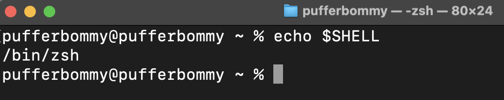

import PostHeader from '../../../components/PostHeader.astro'

<PostHeader {...frontmatter} />

## Step 1: Check Your Shell
type command below in terminal to check your shell. It will be either `bash`(older Macs) or `zsh`(new Macs).

```bash
echo $SHELL
```

You will see output like below.



My Shell is `zsh`

## Step 2: Open Your Shell Configuration File

If you shell is `zsh`, type below command in terminal to open `.zshrc` file.

```bash
code ~/.zshrc
```

or (if you are using bash)

```bash
code ~/.bashrc
```

## Step 3: Add Alias

I added alias for start development server in my project.

```bash
alias d="npm run dev"
```

After adding alias, save the file and close it.

## Step 4: Reload Configuration File

```bash
source ~/.zshrc
```

or (if you are using bash)

```bash
source ~/.bashrc
```

## Step 5: Use Alias

Now you can use alias `d` to start development server.

```bash
d
```

Yay! Succcessfully set alias in Mac. 🎉