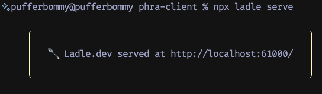
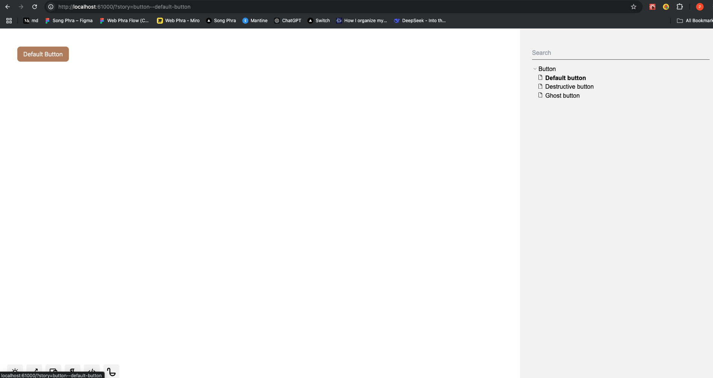

import PostHeader from '../../../components/PostHeader.astro'

<PostHeader {...frontmatter} />

## What is Ladle?

Ladle is a alternative to [Storybook](https://storybook.js.org/). It is a tool for developing and testing your React components in isolation.

## Installation

To use Ladle in your React app, you need to install the following dependencies:

```bash
npm install @ladle/react
```

## Add a story

To add a story, create a new file with the `.stories.tsx` extension anywhere in src folder. For example, create a new file in `src/components/ui/button.stories.tsx`:

```tsx
// button.stories.tsx

export const DefaultButton: Story = () => {
  return (
    <Button>
      Default Button
    </Button>
  )
}

export const DestructiveButton: Story = () => {
  return (
    <Button variant="destructive">
      Destructive Button
    </Button>
  )
}

export const GhostButton: Story = () => {
  return (
    <Button variant="ghost">
      Ghost Button
    </Button>
  )
}
```

## Start Ladle

To see your stories, run the following command:

```bash
npx ladle serve
```

It will show you a URL where you can see your stories.



## Result

You will see your stories in the browser.



## Conclusion

Ladle is a great tool for developing and testing your React components in isolation. It is easy to use and integrates well with React projects.